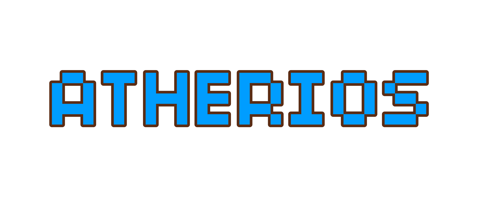

# Atherios Silver v1.0



**Atherios Silver** is a lightweight, high-performance 3D voxel sandbox game built using **Haxe**, **OpenFL**, and **Flixel/Stage3D**, targeting web distribution via compressed Flash binary (`.swf`). The project includes a full client sandbox engine alongside a dedicated **C# .NET** multi-threaded server package for real-time multiplayer interaction.

---

## 🌟 Key Features

* **3D Voxel Engine:** Custom procedural chunk generation featuring face-culling optimizations in `Chunk.hx` and `VoxelWorld.hx`.
* **Zero-Crash Texture Fallback:** Built-in dynamic texture generator (`TextureGenerator.hx`) that safely constructs terrain and UI graphics if visual assets are missing.
* **Resilient Audio Pipeline:** Sound system designed with non-blocking existence checks (`Assets.exists`) so audio missing or loading asynchronously will never freeze or crash the game.
* **Lightweight Web Binary:** Fully optimized to compile into a compact ~5MB–10MB `.swf` executable target.
* **Dedicated Server Package:** Custom C# host application with binary world persistence (`world.dat`), admin permissions parsing (`ops.txt`), and client session routing.

---

## 📁 Repository Structure

```text
Atherios-Silver-v1.0/
│
├── Project.xml                         # Master Haxe/OpenFL build configuration
├── README.md                           # GitHub repository documentation
│
├── assets/                             # Embedded game assets
│   ├── audio/
│   │   ├── menu_theme.ogg              # Main menu background soundtrack
│   │   ├── bgm_game.ogg                # (Optional) In-game ambient soundtrack
│   │   └── sfx/                        # Sound effect directory
│   │       ├── block_place.ogg         # Block placement sound
│   │       ├── block_break.ogg         # Mining sound effect
│   │       ├── step.ogg                # Footstep sound effect
│   │       └── ui_click.ogg            # Button click feedback
│   │
│   ├── fonts/
│   │   └── pixel_font.ttf              # Retro typeface for UI & overhead names
│   │
│   └── textures/
│       ├── icon.png                    # Window/App icon
│       ├── logo.png                    # Widescreen title graphic
│       ├── bg_pattern.png              # Infinite menu scrolling texture
│       ├── terrain.png                 # (Optional) Static block atlas
│       └── ui_sheet.png                # (Optional) Hotbar/HUD graphics
│
├── src/                                # Haxe / OpenFL Client Source Code
│   ├── Main.hx                         # Project entry point & window scalar
│   ├── MenuState.hx                    # Main menu UI & backdrop scroller
│   ├── PlayState.hx                    # Main 3D world interaction loop
│   ├── Player.hx                       # Character controller & WASD physics
│   ├── RemotePlayer.hx                 # Networked player renderer
│   ├── VoxelWorld.hx                   # Procedural terrain generator
│   ├── Chunk.hx                        # Optimised mesh builder & face culling
│   ├── Inventory.hx                    # Hotbar selection state
│   ├── TextureGenerator.hx             # Fallback procedural graphic generator
│   ├── NetworkClient.hx                # TCP Socket bridge for multiplayer
│   └── ChatUI.hx                       # Overlay chat system
│
└── AtheriosServer/                     # Dedicated Host Application (C# .NET)
    ├── Program.cs                      # Host console startup
    ├── ClientManager.cs                # Packet routing & broadcast manager
    ├── WorldState.cs                   # Terrain memory & persistent file writer
    ├── ServerConfig.cs                 # Config property loader
    ├── server.properties               # Server settings file (Port 7777, Seed, Max Players)
    ├── ops.txt                         # Admin list
    └── worlds/
        └── world.dat                   # Auto-saved binary map file
